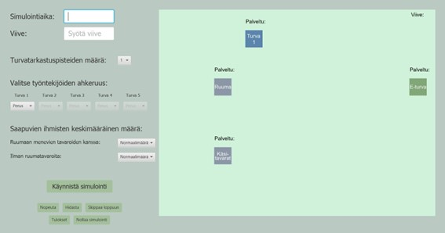
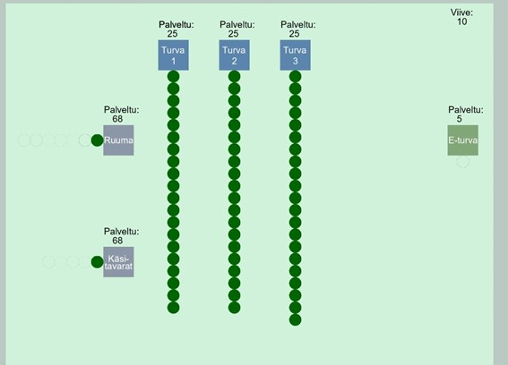
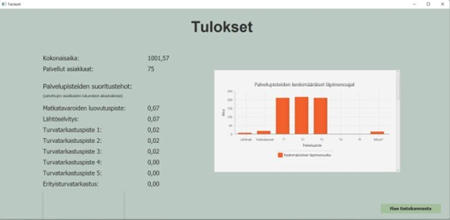

# Simulator desktop application

- Java
- JavaFx
- jUnit Tests
- MariaDB
- Hibernate
- Java Persistence API

Airport-simulator. Test how many people arrive to the airport in given time. Choose how many security controls are available and select how fast the eployees work.

See the arriving people in an animation.

See the results in a graph and get old results from the database.

Project framework by Simo Silander (teacher in Metropolia University of Applied Sciences)  
Project by: Eveliina, Juho, Katja, Sebastian
